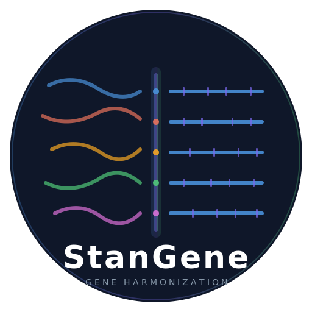
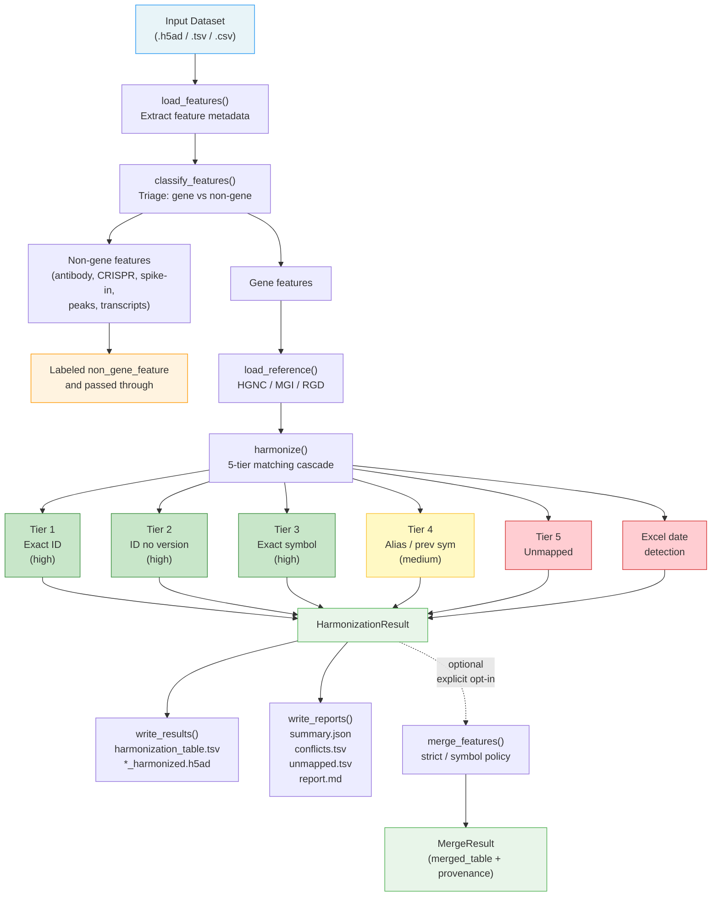

# StanGene: Gene identifier harmonization for single-cell transcriptomics datasets

<p align="center">
  
</p>

<p align="center">
  <a href="https://github.com/chansigit/stangene/actions/workflows/tests.yml"></a>
  <a href="https://chansigit.github.io/stangene/"></a>
  <a href="https://github.com/chansigit/stangene/blob/master/LICENSE"></a>
  <a href="https://www.python.org/"></a>
  <a href="https://github.com/chansigit/stangene/stargazers"></a>
</p>

Gene identifier harmonization for single-cell transcriptomics datasets.

StanGene maps gene features from individual datasets into a shared canonical gene identity system using a tiered matching cascade. It preserves all original information, tracks mapping provenance, and never silently forces ambiguous mappings.

Designed to be invoked as a Claude Code / Codex skill or used as a standalone Python library and CLI tool.

**Documentation:** https://chansigit.github.io/stangene/

---

## Workflow



---

## Install

### Python package

```bash
pip install git+https://github.com/chansigit/stangene.git

# Or from source with dev dependencies:
git clone https://github.com/chansigit/stangene.git
cd stangene
pip install -e ".[dev]"
```

**Dependencies:** pandas, anndata, pyarrow. Downloads use stdlib `urllib` (no `requests`).

### Claude Code plugin

```
/plugins add chansigit/stangene
```

Once installed, ask Claude to "harmonize genes" or "standardize gene names" and the skill activates automatically.

---

## Quick start

### 1. Build reference data (one-time per species)

```bash
stangene build-refs --species human       # downloads HGNC (~15 MB)
stangene build-refs --species mouse       # downloads MGI + BioMart (~10 MB)
stangene build-refs --species rat         # downloads RGD (~5 MB)
stangene build-refs --species zebrafish   # downloads ZFIN
stangene build-refs --species fruit_fly   # downloads FlyBase
stangene build-refs --species c_elegans   # downloads WormBase
# Ensembl-only (BioMart) species:
stangene build-refs --species cynomolgus
stangene build-refs --species rhesus
stangene build-refs --species marmoset
stangene build-refs --species mouse_lemur
```

Or from Python:

```python
from stangene import build_reference

# Dedicated nomenclature authorities
for sp in ["human", "mouse", "rat", "zebrafish", "fruit_fly", "c_elegans"]:
    build_reference(sp)

# Ensembl BioMart (no dedicated authority)
for sp in ["cynomolgus", "rhesus", "marmoset", "mouse_lemur"]:
    build_reference(sp)
```

References are stored locally (in `references/` during development, or `~/.cache/stangene/references` when pip-installed). Re-run with `--force` to update.

### 2. Harmonize a dataset

```python
import stangene

result = stangene.run(
    path="my_data.h5ad",       # or .tsv / .csv / .txt
    species="human",            # or any of: mouse, rat, zebrafish, fruit_fly, c_elegans, cynomolgus, rhesus, marmoset, mouse_lemur
    output_dir="results/",      # where to write reports
    dataset_name="pbmc_10k",    # optional label
)
```

Or via CLI:

```bash
stangene harmonize --input my_data.h5ad --species human --output-dir results/
```

### 3. Review outputs

| File | Contents |
|---|---|
| `harmonization_table.tsv` | Full mapping table, one row per original feature |
| `report.md` | Human-readable markdown report with summary, conflicts, and warnings |
| `summary.json` | Dataset-level statistics as JSON |
| `conflicts.tsv` | Many-to-one collisions, ambiguities, outdated names |
| `unmapped.tsv` | Unmapped features for manual review |
| `*_harmonized.h5ad` | Enriched h5ad with harmonization columns in `adata.var` (if input was h5ad) |

---

## How it works

### Feature classification

Before harmonization, every feature is classified:

| Pattern | Type |
|---|---|
| `ENSG*` / `ENSMUSG*` / `ENSRNOG*` | `gene` |
| `ENST*` / `ENSMUST*` / `ENSRNOT*` | `transcript` |
| `*_ADT`, `*_HTO`, `*TotalSeq*` | `antibody_capture` |
| `sg-*`, `gRNA-*` | `crispr_guide` |
| `ERCC-*` | `spike_in` |
| `chrN:start-end` | `peak` |
| 10x Cell Ranger labels | Mapped directly (`Gene Expression` -> `gene`, etc.) |
| Anything else | `gene` (default, flagged) |

Non-gene features are labeled `non_gene_feature` and excluded from the matching cascade. They are preserved in the output.

### Matching cascade

Gene features are matched in strict priority order. Once a feature is resolved at a tier, lower tiers are skipped.

| Tier | Strategy | Confidence | Example |
|---|---|---|---|
| 1 | Exact Ensembl gene ID | high | `ENSG00000141510` matches directly |
| 2 | Version-stripped Ensembl ID | high | `ENSG00000141510.18` -> `ENSG00000141510` |
| 3 | Exact approved symbol | high | `TP53` matches HGNC approved symbol |
| 4 | Alias or previous symbol | medium | `p53` matches via HGNC alias for TP53 |
| 5 | Unmapped | -- | No confident match; preserved as-is |

**Symbol matching is case-insensitive**: exact case is tried first, then uppercase fallback. This ensures `tp53`, `Tp53`, and `TP53` all resolve correctly.

**Additional checks at each tier:**
- Withdrawn genes matched at Tier 3 are downgraded to `medium` confidence
- Non-protein-coding gene types are noted in `mapping_notes`
- Excel-corrupted date formats (`1-Mar`, `2-Sep`) are detected and marked unmapped
- Known HGNC-renamed genes (MARCH1->MARCHF1, SEPT2->SEPTIN2, etc.) are flagged

### Output schema

Every feature receives these harmonization columns:

| Column | Description |
|---|---|
| `gene_id_harmonized` | Canonical Ensembl gene ID (or source_id fallback, e.g. `RGD:2003`) |
| `gene_symbol_harmonized` | Official approved symbol |
| `mapping_status` | `exact_id`, `id_no_version`, `exact_symbol`, `alias_symbol`, `previous_symbol`, `ambiguous`, `unmapped`, or `non_gene_feature` |
| `mapping_confidence` | `high`, `medium`, `low`, or null |
| `mapping_source` | Which lookup resolved this feature (e.g., `HGNC:approved_symbol`) |
| `mapping_notes` | Warnings, candidate lists, version mismatches |
| `stangene_version` | Version of StanGene that produced the mapping |
| `reference_release` | Timestamp of the reference data used |

Original columns (`original_feature_name`, `original_feature_id`, `original_feature_type`, `feature_id_no_version`) are always preserved.

---

## Detailed API

### Top-level

```python
import stangene

# Full pipeline
result = stangene.run(path, species, output_dir=None, dataset_name=None, reference_dir=None)
# Returns: HarmonizationResult

# Individual stages
stangene.build_reference(species, reference_dir=None, force=False)
ref = stangene.load_reference(species, reference_dir=None)
ft = stangene.load_features(path, species, dataset_name=None, column_map=None)
ft = stangene.classify_features(ft)
result = stangene.harmonize(ft, ref)

# Reporting
stats = stangene.summary(result)
conflicts = stangene.conflict_report(result)
md_report = stangene.generate_markdown_report(result)
stangene.write_reports(result, output_dir)

# Optional merge
merge_result = stangene.merge_features(result, policy="strict")

# Special gene masks (QC)
mito = stangene.mito_mask(symbols, species)   # mitochondrial genes
hb   = stangene.hb_mask(symbols, species)     # hemoglobin genes

# Biotype normalization
stangene.CANONICAL_BIOTYPES                   # frozenset of 13 canonical categories
label = stangene.normalize_biotype(raw, source)  # raw gene_type string → canonical label
```

### `stangene.run()`

Convenience function that chains the full pipeline:

1. `load_features()` -- extract feature metadata from h5ad or TSV
2. `classify_features()` -- triage gene vs. non-gene features
3. `load_reference()` -- load pre-built annotation tables (raises `ReferenceNotFoundError` if not built)
4. `harmonize()` -- run the 5-tier matching cascade
5. `write_results()` + `write_reports()` -- write outputs (if `output_dir` provided)

### `HarmonizationResult`

```python
@dataclass
class HarmonizationResult:
    mapping_table: pd.DataFrame    # full FeatureTable with harmonization columns
    conflicts: pd.DataFrame        # many-to-one collision rows
    stats: dict                    # counts per mapping_status
```

### `MergeResult`

```python
@dataclass
class MergeResult:
    merged_table: pd.DataFrame     # collapsed rows
    provenance: pd.DataFrame       # which originals contributed to each merge
    merge_log: list[str]           # human-readable merge decisions
```

---

## Conservative merge

Merge is **never automatic**. It must be explicitly requested.

```python
from stangene import merge_features

# Strict: only merge rows sharing gene_id_harmonized via Tier 1 or 2 (ID-based)
merge_result = merge_features(result, policy="strict")

# Symbol: also merge Tier 3 (exact approved symbol) matches
merge_result = merge_features(result, policy="symbol")
```

**Never merges:** Tier 4 (alias/previous symbol), ambiguous, unmapped, or non-gene features.

Every merge is recorded in `merge_result.provenance` with the original rows and merge reason, making it fully reversible.

---

## Supported species

| Species | Common name | Authority | Primary ID prefix | Source |
|---|---|---|---|---|
| `human` | Human (*Homo sapiens*) | [HGNC](https://www.genenames.org/) | `ENSG` | ~15 MB |
| `mouse` | Mouse (*Mus musculus*) | [MGI](https://www.informatics.jax.org/) + Ensembl BioMart | `ENSMUSG` | ~10 MB |
| `rat` | Rat (*Rattus norvegicus*) | [RGD](https://rgd.mcw.edu/) | `ENSRNOG` | ~5 MB |
| `zebrafish` | Zebrafish (*Danio rerio*) | [ZFIN](https://zfin.org/) | `ENSDARG` | ZFIN genes + aliases |
| `fruit_fly` | Fruit fly (*D. melanogaster*) | [FlyBase](https://flybase.org/) | `FBgn` | FlyBase annotation + synonyms |
| `c_elegans` | Roundworm (*C. elegans*) | [WormBase](https://wormbase.org/) | `WBGene` | WormBase geneIDs + geneOtherIDs |
| `cynomolgus` | Cynomolgus macaque (*M. fascicularis*) | Ensembl BioMart | `ENSMFAG` | Ensembl |
| `rhesus` | Rhesus macaque (*M. mulatta*) | Ensembl BioMart | `ENSMMUG` | Ensembl |
| `marmoset` | Common marmoset (*C. jacchus*) | Ensembl BioMart | `ENSCJAG` | Ensembl |
| `mouse_lemur` | Mouse lemur (*M. murinus*) | Ensembl BioMart | `ENSMICG` | Ensembl |

### Reference internals

Built references are stored as:

```
references/<species>/
  gene_table.parquet       # one row per gene
  symbol_lookup.parquet    # flattened symbol->gene index
  build_metadata.json      # source URLs, timestamps, checksums
```

`gene_table` columns: `ensembl_id`, `symbol`, `alias_symbols`, `prev_symbols`, `gene_type`, `canonical_biotype`, `status`, `source`, `source_id`

`symbol_lookup` columns: `lookup_string`, `lookup_string_upper`, `ensembl_id`, `source_id`, `lookup_type`, `source`

---

## Conflict detection

The conflict report (`conflicts.tsv`) and markdown report (`report.md`) flag:

| Conflict type | Description |
|---|---|
| `many_to_one` | Multiple original features map to the same canonical gene ID |
| `unmapped` | Feature could not be matched to any reference gene |
| `ambiguous` | Feature matched multiple candidate genes |
| `outdated_name` | Feature resolved via a previous symbol (likely renamed) |

Additionally, the report detects:
- **Excel date artifacts:** Gene names corrupted by spreadsheet auto-formatting (`1-Mar`, `2-Sep`)
- **Known Excel-renamed genes:** Symbols renamed by HGNC in 2020 (e.g., MARCH1->MARCHF1, SEPT2->SEPTIN2)

---

## Input formats

### h5ad (primary)

Reads `adata.var` metadata. Extracts `gene_ids`, `feature_types`, and `genome` columns if present. Does **not** load the expression matrix.

When writing results, harmonization columns are added to `adata.var` in a new `*_harmonized.h5ad` file. Original `var_names` are never overwritten.

### TSV / CSV / TXT

Reads the table and auto-detects common column names:

| Detected column name | Maps to |
|---|---|
| `gene`, `gene_name`, `feature_name`, `gene_symbol`, `symbol` | `original_feature_name` |
| `gene_id`, `gene_ids`, `ensembl_id`, `ensembl_gene_id`, `feature_id` | `original_feature_id` |
| `feature_types`, `feature_type` | `original_feature_type` |

If no column names are recognized, the first column is used as `original_feature_name`.

Or pass an explicit `column_map`:

```python
ft = stangene.load_features(
    "features.tsv",
    species="human",
    column_map={"my_gene_col": "original_feature_name", "my_id_col": "original_feature_id"},
)
```

File extension determines the delimiter: `.tsv`/`.txt` = tab, `.csv` = comma.

---

## Design principles

1. **Never destroy original information.** All original identifiers are preserved. Harmonized identifiers live in separate columns.
2. **Stable IDs over symbols.** Ensembl gene IDs are the canonical key. Gene symbols are a display layer.
3. **Separate identity from display.** `gene_id_harmonized` (identity) and `gene_symbol_harmonized` (display) are distinct.
4. **Within-species only.** Cross-species linkage via orthology is a separate concern, not conflated with name harmonization.
5. **Conservative by default.** An explicit `ambiguous` or `unmapped` is always better than an incorrect forced mapping.
6. **Full traceability.** Every mapping records its tier, confidence, source, and notes.

---

## Adding a new species

1. Add a `SpeciesConfig` entry in `src/stangene/species.py` with the species' Ensembl prefix, naming convention, and reference source URLs.
2. Add classification patterns if needed (e.g., new Ensembl prefix patterns for both gene and transcript IDs).
3. Implement a `_build_<species>_reference()` function in `references.py` that downloads source files, builds `gene_table` and `symbol_lookup` DataFrames, and calls `_save_reference()`.
4. Add the dispatch to `build_reference()`.

See the [rat (RGD) implementation](src/stangene/references.py) for a complete example.

---

## Testing

```bash
# Run unit tests (fast, no network)
python -m pytest tests/ --ignore=tests/test_pbmc3k.py -v

# Run integration tests with real data (requires network + scanpy)
python -m pytest tests/test_pbmc3k.py -v

# Run all tests
python -m pytest tests/ -v
```

334 unit tests + integration tests covering: species config (human/mouse/rat/zebrafish/fruit_fly/c_elegans/cynomolgus/rhesus/marmoset/mouse_lemur), feature classification, I/O adapters (h5ad/TSV/CSV/TXT), reference building (HGNC/MGI/RGD/ZFIN/FlyBase/WormBase/Ensembl BioMart), all 5 harmonization tiers (including non-Ensembl FBgn/WBGene IDs), case-insensitive matching, Excel corruption detection, withdrawn gene handling, conservative merge, markdown reporting, empty input handling, canonical biotype normalization (all sources + integration across all 10 species), and end-to-end integration on the 10x pbmc3k dataset.

---

## Project structure

```
stangene/
├── pyproject.toml
├── README.md
├── LICENSE                      # MIT
├── skill.md                     # Claude Code skill definition
├── .readthedocs.yaml            # Read the Docs config
├── src/stangene/
│   ├── __init__.py              # public API: run(), re-exports
│   ├── __main__.py              # CLI: harmonize, build-refs
│   ├── species.py               # SpeciesConfig, classification patterns, Excel lists
│   ├── classify.py              # classify_features()
│   ├── io.py                    # load_features(), write_results()
│   ├── references.py            # build_reference(), load_reference()
│   ├── harmonize.py             # harmonize(), HarmonizationResult
│   ├── merge.py                 # merge_features(), MergeResult
│   ├── report.py                # summary(), conflict_report(), generate_markdown_report(), write_reports()
│   ├── mito.py                  # mito_mask() — species-aware mitochondrial gene detection
│   ├── hb.py                    # hb_mask() — species-aware hemoglobin gene detection
│   ├── biotype.py               # CANONICAL_BIOTYPES, normalize_biotype()
│   └── _logging.py              # structured logging
├── references/                  # built by build_reference(), gitignored
├── tests/
│   ├── conftest.py              # shared mock fixtures
│   ├── test_species.py
│   ├── test_classify.py
│   ├── test_io.py
│   ├── test_references.py
│   ├── test_harmonize.py
│   ├── test_biotype.py
│   ├── test_merge.py
│   ├── test_report.py
│   ├── test_markdown_report.py
│   ├── test_edge_cases.py
│   ├── test_run.py
│   └── test_pbmc3k.py           # integration test on real 10x data
├── docs/                        # Sphinx docs (GitHub Pages)
│   ├── conf.py
│   ├── index.md
│   ├── quickstart.md
│   ├── how-it-works.md
│   ├── api/                     # auto-generated API reference
│   └── _static/logo.{svg,png}
└── .github/workflows/
    ├── tests.yml                # CI: pytest on Python 3.10/3.11/3.12
    └── docs.yml                 # deploy docs to GitHub Pages
```
